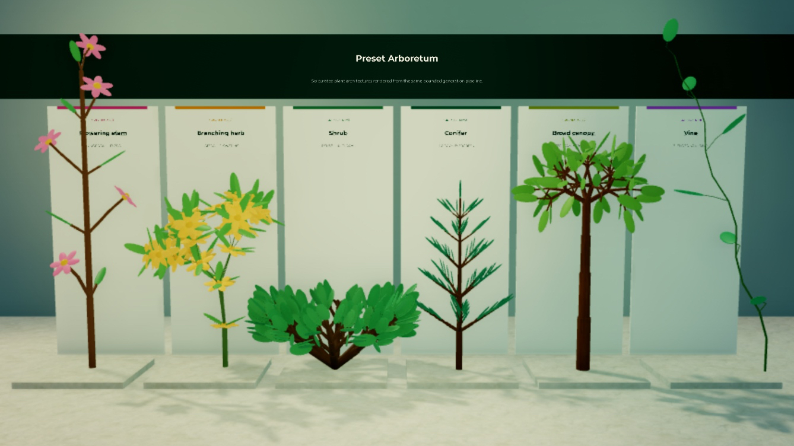
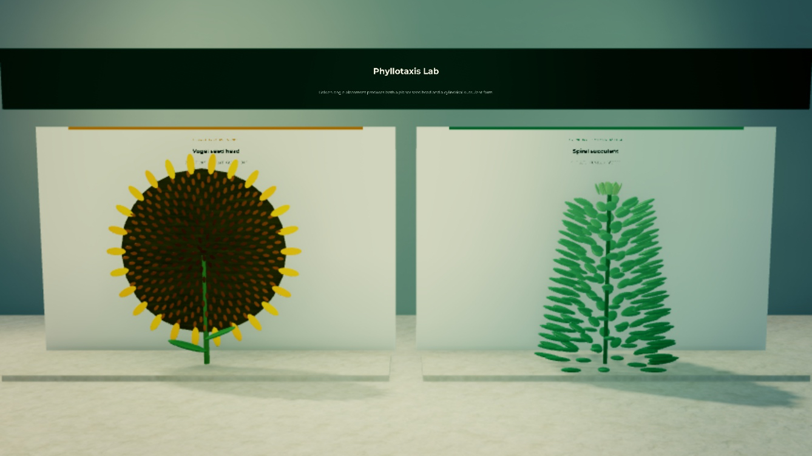
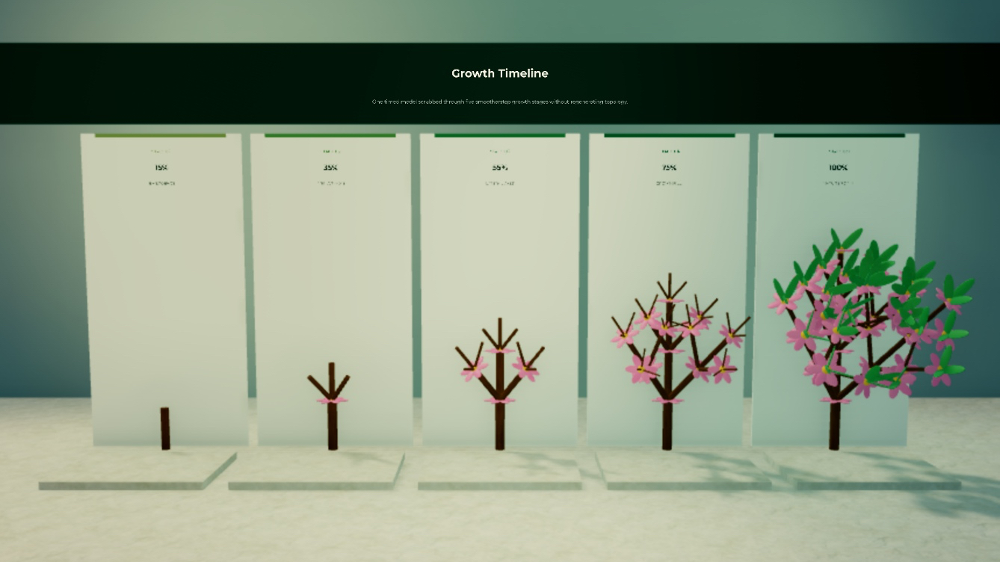
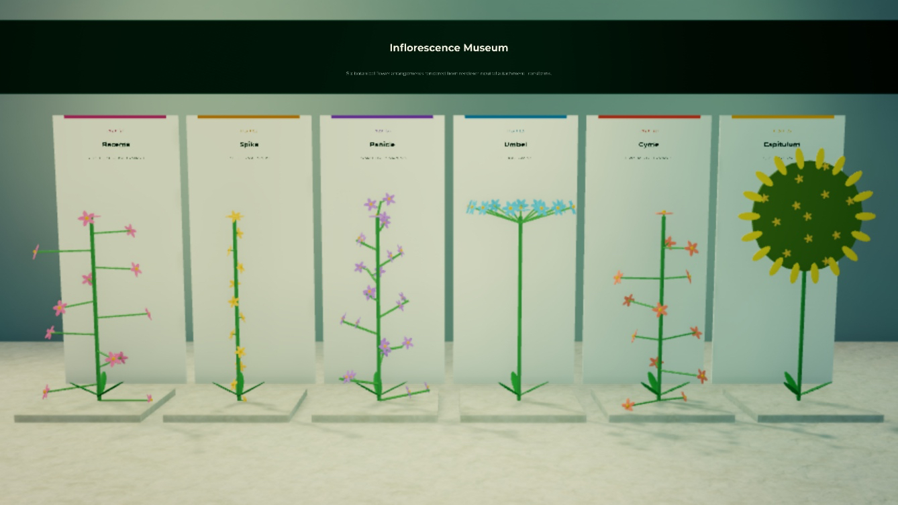

# @rbxts/a-plant-generator

[](https://github.com/mateusdcc/plant-generator/actions/workflows/ci.yml)
[](https://www.npmjs.com/package/@rbxts/a-plant-generator)
[](https://mateusdcc.github.io/plant-generator/)
[](LICENSE)

Deterministic, renderer-independent procedural botany for roblox-ts. It combines
bounded L-system derivation, stable 2D/3D turtles, plant topology, mesh builders,
phyllotaxis, developmental animation, cellular map systems, IFS utilities, and
optional Roblox renderers without depending on a game framework.

Status: **0.1.2**. Core APIs are usable; cellular maps and EditableMesh adapters
are explicitly experimental while their mechanisms are functional and tested.

| Preset architectures                                                                        | Golden-angle phyllotaxis                                                                     |
| ------------------------------------------------------------------------------------------- | -------------------------------------------------------------------------------------------- |
|     |       |
| Growth progression                                                                          | Inflorescence architectures                                                                  |
|  |  |

## Install

```sh
npm install @rbxts/a-plant-generator
```

## 30-second quick start

```ts
import { PLANT_PRESETS, PlantCompiler, PlantGenerator } from "@rbxts/a-plant-generator";

const model = PlantCompiler.compile(PLANT_PRESETS["broad-canopy-tree"]!);
const plant = PlantGenerator.generate(model, {
	seed: 12345,
	iterations: 5,
	limits: { maxSymbols: 50_000, maxSegments: 5_000 },
});

print(plant.statistics.segments, plant.descriptor.modelHash);
```

The same model, seed, parameters, time, and limits produce the same topology and
compact descriptor. Derivation never creates Instances.

## Growth and rendering

```ts
import { PartPlantRenderer, PlantCompiler, PlantGenerator, PLANT_PRESETS } from "@rbxts/a-plant-generator";

const model = PlantCompiler.compile(PLANT_PRESETS["timed-tree"]!);
const result = PlantGenerator.generate(model, { seed: 9, iterations: 4 });

// Parent ownership is explicit; the renderer never assumes Workspace.
const renderer = new PartPlantRenderer({ parent: script, maxInstances: 2_000 });
const handle = renderer.render(result);
handle.setGrowth(0.65);
handle.setLod("medium");
// Later: handle.destroy(); renderer.destroy();
```

For frame-budgeted generation:

```ts
const session = PlantGenerator.createSession(model, {
	seed: 9,
	iterations: 6,
	limits: { maxWorkUnits: 250_000 },
});
while (!session.isComplete()) session.step(500);
const result = session.getResult();
```

## Capabilities

- deterministic context-free, stochastic, context-sensitive, parametric, and
  bracketed rewriting;
- edge/node replacement graphs with explicit contact points;
- stable 2D/3D turtles, polygon capture, custom commands, tropism, and axial
  branch context;
- renderer-neutral branch graphs, buds, attachments, pruning, bounds, biomass,
  traversal, and hashes;
- tubes with parallel-transport frames, mesh validation/merge/transform,
  blades, petals, ribbons, disks, compound leaves, and flowers;
- planar/cylindrical phyllotaxis, deterministic jitter, spacing relaxation, and
  parastichy analysis;
- timed symbols, absolute-time scrubbing, event enumeration, and built-in,
  piecewise, keyframed, or registered growth functions;
- experimental planar/spherical/3D cellular structures and weighted/controlled
  IFS tools;
- versioned model specs, migrations, named behavior registries, immutable preset
  extension, compact network descriptors, LRU caches, and strict budgets;
- pooled/batched Part rendering with default or custom organ Parts, plus an
  injected, size-guarded EditableMesh capability boundary.

## Architecture and performance

The pipeline is `model spec -> compiled production index -> bounded derivation ->
turtle -> branch graph -> optional mesh -> optional renderer`. Core modules use
plain data and never access Roblox services. See [Architecture](docs/ARCHITECTURE.md),
[Concepts](docs/CONCEPTS.md), [Book coverage](docs/BOOK_COVERAGE.md), and
[Performance](docs/PERFORMANCE.md).

Exponential derivation is always a risk. Set symbol, segment, vertex, triangle,
stack, iteration, Instance, and total work limits for untrusted or user-authored
models. Prefer incremental sessions and distance LOD for interactive worlds.

## Compatibility

- roblox-ts 3.0.0;
- TypeScript 5.5.3, matching the compiler's pinned TypeScript line;
- `@rbxts/types` 1.0.938 or compatible later API dumps;
- Node 20.19 or newer for development tools;
- EditableMesh requires the Roblox capability/security settings described in
  [Roblox rendering](docs/ROBLOX_RENDERING.md).

## Guides

[Getting started](docs/GETTING_STARTED.md) · [Examples](docs/EXAMPLES.md) ·
[L-systems](docs/L_SYSTEMS.md) ·
[Turtles](docs/TURTLE_INTERPRETATION.md) · [Tree modeling](docs/TREE_MODELING.md) ·
[Phyllotaxis](docs/PHYLLOTAXIS.md) · [Animation](docs/ANIMATION.md) ·
[Networking](docs/NETWORKING_RECIPE.md) · [Extending](docs/EXTENDING.md) ·
[Security](docs/SECURITY.md) · [Troubleshooting](docs/TROUBLESHOOTING.md)

API reference and all guides are published at
[mateusdcc.github.io/plant-generator](https://mateusdcc.github.io/plant-generator/).

## Contributing and license

See [CONTRIBUTING.md](CONTRIBUTING.md). Package code is MIT licensed.
_The Algorithmic Beauty of Plants_ and its text, figures, photographs, and
illustrations are not included and are not licensed by this repository; see
[NOTICE.md](NOTICE.md) and [Academic references](docs/ACADEMIC_REFERENCES.md).
