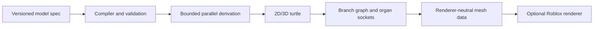

# Architecture

## ADR-001: data-oriented generation with adapter rendering

Status: accepted for 0.1.0.

The core represents words, topology, organs, meshes, timelines, and diagnostics
as plain data. This makes deterministic hashes, serialization, tests, caching,
network reconstruction, and non-Roblox use practical. Grammar derivation does
not know about turtles; turtle interpreters do not know about Instances; mesh
builders do not know about Workspace.

### Deterministic seeds

Every random decision is drawn from an explicit `RandomSource`. The default
xorshift32 stream is initialized from a normalized nonzero 32-bit seed. A
compiled model never owns mutable random state; each generation session owns
its stream, so cache order and concurrent callers cannot change results.

### Bounded derivations

Limits are inputs, not global configuration. Derivation, interpretation,
geometry, cellular subdivision, IFS sampling, and rendering charge work units
and stop at explicit count limits. Tolerant mode returns a deterministic partial
result with structured diagnostics; strict mode rejects invalid inputs before
generation.

### Registries and serialization

Callbacks cannot be serialized safely. Specifications therefore refer to
consumer-registered production, predicate, growth, organ, geometry, and
renderer behavior by stable IDs. Deserialization validates IDs against a
caller-controlled allow-list. Preset extension performs immutable deep
overrides and never mutates its parent.

### API maturity

Unannotated exports are stable within the 0.x compatibility policy. `@beta`
exports are usable but may receive signature refinements in a minor release.
`@experimental` cellular and EditableMesh boundaries are functional and tested
at their data-conversion boundaries, but follow evolving platform APIs.

## Dependency direction

`core` and `math` are leaves. `turtle` depends on them; `topology` and
`geometry` consume turtle data; `botanical` and `animation` compose those
mechanisms; `runtime` orchestrates and serializes. Only `roblox` may create
Instances or access services, and it receives an explicit parent rather than
assuming Workspace.
