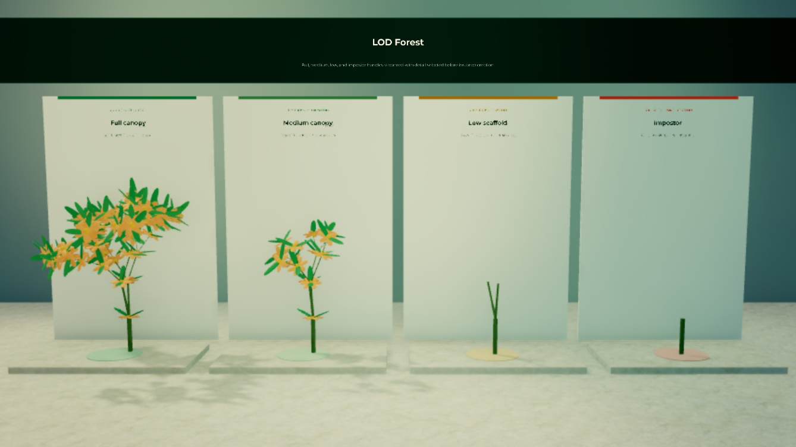

# LOD comparison

`DistanceLodPolicy` turns caller-owned camera distance into a standard detail
level and a set of suggested generation/render budgets. The scene displays the
same flowering herb in all four distance bands.

_Left to right: full at 25 studs, medium at 90, low at 200, and impostor at 500.
The topology is held constant while streamed branch and organ count falls._

{@includeCode ../../examples/lod-comparison/index.ts}

The example calls `setLod` on a streaming handle before its first `step`, so
excluded branches never acquire Parts. Calling `setLod` only after `render`
would provide the same visual hiding but would not reduce `renderedInstances`.

Try moving the three policy thresholds while keeping the sample distances fixed
to verify the band transitions.
