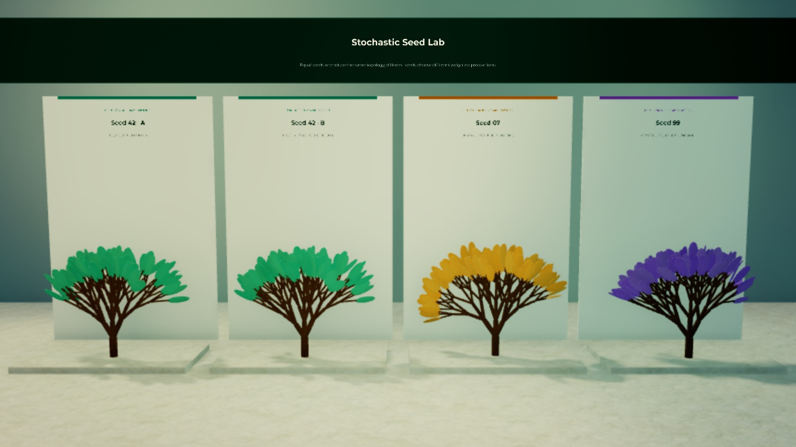

# Seed determinism

Generation is deterministic for the same compiled model, seed, iterations,
parameters, time, and limits. This example uses a weighted grammar so the first
two trees replay exactly while the remaining trees change only the seed.

_Left to right: seed 42 reference, seed 42 replay, seed 7, and seed 99. Canopy
color is a diagnostic aid; the matching cyan pair has identical graph hashes._

{@includeCode ../../examples/seed-determinism/index.ts}

`replayMatches` is a topology check, not an image comparison. A networked game
can replicate the compact descriptor and regenerate the same plant instead of
sending every branch transform.

Try changing `iterations` in only one call; the hashes should then differ even
when the seed matches.
